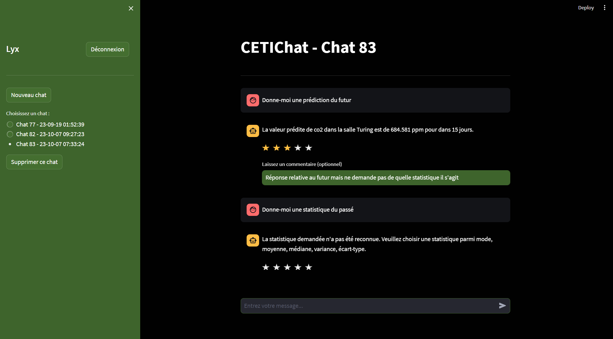
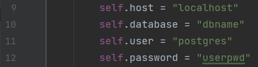

<h1>CETIChat</h1>

**_Par le CETIC, pour le CETIC_**

---

<h2>Etapes d'installation</h2>
- Installer toutes les dépendances du fichier **requirements.txt**
- Modifier les strings de connexion à la DB dans le fichier **Services/DBConnection.py**
  

<h2>Lancement de l'application</h2>
- Effectuer la commande **streamlit run main.py** (Vérifier que l'on est bien connecté dans le **(venv)** sur le terminal sinon elle ne fonctionnera pas)